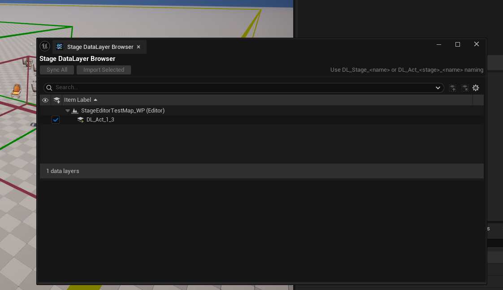

# Phase 4: DataLayerOutliner UI 扩展

> 日期: 2025-11-29 12:00-12:35
> 状态: ✅ 完成

---

## 1. 预研目标

确定如何在 DataLayerOutliner 中添加自定义列（Sync Status、SUID、Actions）。

---

## 2. 源码分析

引擎源码路径：`C:\Program Files\Epic Games\UE_5.6\Engine\Source\Editor\DataLayerEditor\`

### 2.1 架构理解

```
SDataLayerBrowser (主容器 Widget)
└── SDataLayerOutliner : SSceneOutliner (TreeView)
    └── FDataLayerMode : ISceneOutlinerMode (模式，控制行为)
        └── ISceneOutlinerColumn (列接口)
```

### 2.2 关键发现

| 文件 | 位置 | 发现 |
|------|------|------|
| `SDataLayerOutliner.h` | Private | 继承自 `SSceneOutliner` |
| `SDataLayerBrowser.cpp:149-165` | Private | 列通过 `InitOptions.ColumnMap.Add()` 注册 |
| `DataLayerMode.h` | **Private** | `FDataLayerMode` 无法直接使用 |
| `DataLayerEditorSubsystem.h:149-168` | Public | 事件广播：`OnDataLayerChanged()` |
| `DataLayerEditorModule.h` | Public | API：`CreateDataLayerBrowser()` |

### 2.3 列注册机制

**SDataLayerBrowser.cpp:156-164**

```cpp
InitOptions.ColumnMap.Add(
    FDataLayerOutlinerIsVisibleColumn::GetID(),
    FSceneOutlinerColumnInfo(
        ESceneOutlinerColumnVisibility::Visible,  // 可见性
        0,                                         // 优先级（越小越靠左）
        FCreateSceneOutlinerColumn::CreateLambda([](ISceneOutliner& InSceneOutliner) {
            return MakeShareable(new FDataLayerOutlinerIsVisibleColumn(InSceneOutliner));
        })
    )
);
```

### 2.4 事件同步机制

**DataLayerEditorSubsystem.h:149-168**

```cpp
DECLARE_EVENT_ThreeParams(UDataLayerEditorSubsystem, FOnDataLayerChanged,
    const EDataLayerAction /*Action*/,           // Add/Modify/Delete/Rename/Reset
    const TWeakObjectPtr<const UDataLayerInstance>& /*ChangedDataLayer*/,
    const FName& /*ChangedProperty*/);
FOnDataLayerChanged& OnDataLayerChanged() { return DataLayerChanged; }

DECLARE_EVENT_OneParam(UDataLayerEditorSubsystem, FOnActorDataLayersChanged,
    const TWeakObjectPtr<AActor>& /*ChangedActor*/);
FOnActorDataLayersChanged& OnActorDataLayersChanged() { return ActorDataLayersChanged; }
```

---

## 3. 方案讨论

### 3.1 备选方案

| 方案 | 描述 | 优点 | 缺点 |
|------|------|------|------|
| A | 扩展原有 DataLayerOutliner | 用户无需切换窗口 | 需 hack 私有类，升级风险 |
| **B** | **创建独立 Tab（包装器）** | **可控，维护简单** | 无法添加自定义列 |

### 3.2 同步问题讨论

**Q: 创建独立 Tab 会有同步问题吗？**

**A: 不会。** 两个 Tab 操作同一份底层数据，引擎事件机制保证同步：

| 场景 | 原生 Outliner | Stage Tab | 同步机制 |
|------|--------------|-----------|---------|
| 原生创建 DataLayer | 调用 API | 收到事件 | `OnDataLayerChanged(Add)` |
| Stage Tab 导入 | 调用相同 API | 自己刷新 | 原生收到事件 |

### 3.3 最终决策

**选择方案 B：创建独立的 Stage DataLayer Tab**

理由：
1. `FDataLayerMode` 在 Private 目录，无法直接使用
2. `FDataLayerEditorModule::CreateDataLayerBrowser()` 提供公开 API
3. 代码干净，升级安全

---

## 4. 实施记录

### 4.1 创建的文件

| 文件 | 说明 |
|------|------|
| `Public/DataLayerSync/SStageDataLayerBrowser.h` | Widget 头文件 |
| `Private/DataLayerSync/SStageDataLayerBrowser.cpp` | Widget 实现 |

### 4.2 核心代码

```cpp
void SStageDataLayerBrowser::Construct(const FArguments& InArgs)
{
    SubscribeToEvents();

    // 获取原生 Browser（包装器方案）
    FDataLayerEditorModule& DataLayerEditorModule =
        FModuleManager::LoadModuleChecked<FDataLayerEditorModule>("DataLayerEditor");
    TSharedRef<SWidget> NativeDataLayerBrowser = DataLayerEditorModule.CreateDataLayerBrowser();

    ChildSlot
    [
        SNew(SVerticalBox)
        + SVerticalBox::Slot().AutoHeight()[ /* 标题 */ ]
        + SVerticalBox::Slot().AutoHeight()[ BuildToolbar() ]
        + SVerticalBox::Slot().AutoHeight()[ SNew(SSeparator) ]
        + SVerticalBox::Slot().FillHeight(1.0f)[ NativeDataLayerBrowser ]
    ];
}

void SStageDataLayerBrowser::SubscribeToEvents()
{
    if (UDataLayerEditorSubsystem* Subsystem = UDataLayerEditorSubsystem::Get())
    {
        OnDataLayerChangedHandle = Subsystem->OnDataLayerChanged().AddSP(
            this, &SStageDataLayerBrowser::OnDataLayerChanged);
        OnActorDataLayersChangedHandle = Subsystem->OnActorDataLayersChanged().AddSP(
            this, &SStageDataLayerBrowser::OnActorDataLayersChanged);
    }
}
```

### 4.3 修改的文件

- `StageEditorModule.h` - 添加 `StageDataLayerBrowserTabName`
- `StageEditorModule.cpp` - 注册 Tab spawner

### 4.4 编译与测试

**编译结果：**
```
Result: Succeeded
Total execution time: 17.33 seconds
```

**测试结果：**
- ✅ Window > Tools > Stage DataLayer Browser
- ✅ Tab 正常打开
- ✅ 工具栏显示（Sync All、Import Selected）
- ✅ 原生 DataLayerBrowser 嵌入正常

**测试截图：**
> 

---

*文档结束*
